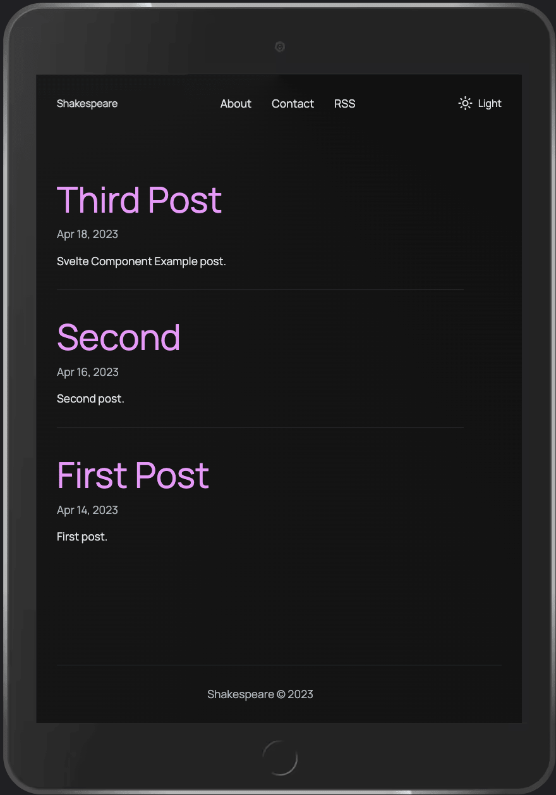
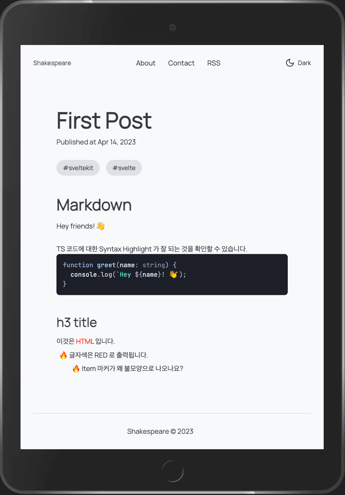
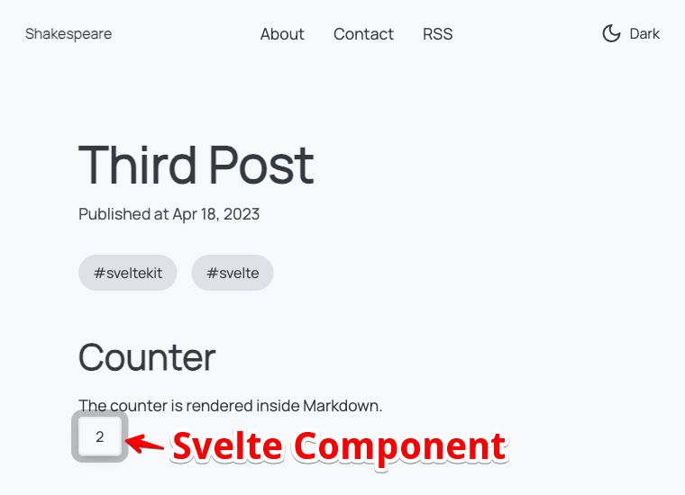

# SvelteKit Blog 만들기

JoyOfCode 블로거의 SvelteKit Blog 만들기를 따라한 클론 프로젝트입니다.

> 참고문서

- [Build A SvelteKit Markdown Blog](https://joyofcode.xyz/sveltekit-markdown-blog)
- [유튜브 - Build a Blazing Fast SvelteKit Markdown Blog](https://www.youtube.com/watch?v=RhScu3uqGd0)

> 화면 캡쳐





## 프로젝트 생성

If you're seeing this, you've probably already done this step. Congrats!

```bash
$ pnpm create svelte@latest svltk-blog-joyofcode
  - Skeleton project
  - TypeScript

$ cd svltk-blog-joyofcode
$ pnpm install

$ pnpm run dev
```

## Developing

### 라이브러리 추가

- [open-props](https://github.com/argyleink/open-props) : Open Source CSS Variables
  - 색상, 타이포그래피, 그림자 등의 CSS 변수를 제공합니다.
- [lucide-svelte](https://github.com/lucide-icons/lucide) : Svelte 를 위한 [lucide icon library](https://lucide.dev/)
  - fontawesome/icons 의 svelte 버전이라고 생각하면 됩니다.
- 폰트 : @fontsource/manrope @fontsource/jetbrains-mono

```bash
pnpm i open-props lucide-svelte @fontsource/manrope @fontsource/jetbrains-mono

pnpm i -D mdsvex  # preprocessor for Svelte

pnpm i shiki  # Syntax Highlighter
```

> open-props 예시 (postcss)

```css
@import 'https://unpkg.com/open-props';

.card {
  border-radius: var(--radius-2);
  padding: var(--size-fluid-3);
  box-shadow: var(--shadow-2);

  &:hover {
    box-shadow: var(--shadow-3);
  }

  @media (--motionOK) {
    animation: var(--animation-fade-in);
  }
}
```

### 레이아웃 구성

> `src/routes/+layout.svelte`

- Header : Title, Menu(About, Contact, RSS), Theme Toggle
- Main
  - PageTransition : Page 전환 애니메이션(fade)
    - key block : key 값이 변경되면 key block 의 내용이 삭제되고 다시 생성된다.
      - 참고: [Svelte - Transition 의 트리거로서 사용된다](https://learn.svelte.dev/tutorial/key-blocks)
    - Section : Posts 리스트 출력
- Footer : CopyRight, Link

> `src/routes/[slug]/*`

- `+page.svelte` : Post 페이지 (article)
  - `svelte:head` : title, seo(og 태그)
  - hgroup : title, date
  - tags : tag list
  - content : `svelte:component` 로 md 파일을 렌더링
- `+page.ts` : slug 이름의 md 파일을 읽어와 content, meta 를 전달
  - meta : title, date, tags(categories)

```ts
import type { PageLoad } from './$types';
import { error } from '@sveltejs/kit';

export const load: PageLoad = async ({ params }) => {
  try {
    const post = await import(`../../posts/${params.slug}.md`);

    return {
      content: post.default,
      meta: post.metadata,
    };
  } catch (e) {
    throw error(404, `Could not find post with slug "${params.slug}"`);
  }
};
```

> `src/posts/*.md`

- first-post.md, second-post.md, example.md (Counter 버튼 예시)
- counter.svelte : 예시용 Svelte 컴포넌트



> `src/app.html`

- icon 설정
- meta 설정 : rss
- script module(=defer) 설정 : color-schema(theme) 설정

> `src/routes/error.html`

- 사용자 정의 템플릿으로 error 메시지 출력

### 코드 작성 (TS)

#### lib 폴더

> `$lib/index.ts`

- title, description 정의
- dev 모드인지 확인하여 url 을 다르게 설정

```ts
import { dev } from '$app/environment';
export const url = dev ? 'http://localhost:5173/' : 'https://joyofcode.xyz/';
```

> `$lib/theme.ts`

- writable store 를 사용하여 theme 을 저장하고 변경
  - localStorage.setItem
  - documentElement.setAttribute

> `$lib/types.ts`

- Post 타입 정의
- Category 타입 정의

> `$lib/utils.ts`

- 문자열 날짜값을 medium date format 으로 출력
  - [Intl.DateTimeFormat](https://developer.mozilla.org/en-US/docs/Web/JavaScript/Reference/Global_Objects/Intl/DateTimeFormat) 사용 (JS 내장 객체)

#### API handlers

> `src/routes/api/posts/+server.ts`

- [GET handler](https://learn.svelte.dev/tutorial/get-handlers) : `/api/posts`
- getPosts() 함수
  - import.meta.glob() : glob 패턴으로 md 파일들을 읽어온다.
  - 파일명에서 slug 를 추출
  - file.metadata 에 slug 를 더해 Post 타입으로 변환
  - published 가 true 인 경우만 posts 에 추가
  - posts 를 date 기준으로 정렬

```ts
import { json } from '@sveltejs/kit';
import type { Post } from '$lib/types';
import type { RequestHandler } from './$types';

async function getPosts() {
  let posts: Post[] = [];

  const paths = import.meta.glob('/src/posts/*.md', { eager: true });

  for (const path in paths) {
    const file = paths[path];
    const slug = path.split('/').at(-1)?.replace('.md', '');

    if (file && typeof file === 'object' && 'metadata' in file && slug) {
      const metadata = file.metadata as Omit<Post, 'slug'>;
      const post = { ...metadata, slug } satisfies Post;
      post.published && posts.push(post);
    }
  }

  posts = posts.sort((first, second) => new Date(second.date).getTime() - new Date(first.date).getTime());

  return posts;
}

export const GET: RequestHandler = async () => {
  const posts = await getPosts();
  return json(posts);
};
```

> `src/routes/api/rss.xml.ts`

- [Prerendering](https://kit.svelte.dev/docs#prerendering) : 빌드 시점에 미리 렌더링하여 정적 파일로 생성
- [GET handler](https://learn.svelte.dev/tutorial/get-handlers) : `/rss.xml`
- `api/posts` 에서 posts 를 읽어와 rss.xml 을 생성
  - xml 이라서 json() 대신 new Response() 사용

```ts
export const prerender = true;

import * as config from '$lib/index';
import type { Post } from '$lib/types';
import type { RequestHandler } from './$types';

export const GET: RequestHandler = async ({ fetch }) => {
  const response = await fetch('api/posts');
  const posts: Post[] = await response.json();

  const headers = { 'Content-Type': 'application/xml' };

  const xml = `
    <rss xmlns:atom="http://www.w3.org/2005/Atom" version="2.0">
    <channel>
      ...(생략)
    </channel>
    </rss>
  `.trim();

  return new Response(xml, { headers });
};
```

#### Theme Toggle

> `src/routes/toggle.svelte` : Theme Toggle 버튼 컴포넌트

- `$theme` 값에 따라 if 블럭으로 Sun/Moon 아이콘 출력
- Theme 에 따라 Sun/Moon 아이콘을 fly transition 으로 전환
- click 이벤트에 toggleTheme 함수를 바인딩

> `src/app.html`

- localStorage 로부터 color-schema 를 읽어 theme 설정
  - `localStorage.getItem('color-scheme');`
  - `document.documentElement.setAttribute('color-scheme', theme)`

> `app.css` : CSS color-scheme 설정

```css
:root {
  color-scheme: dark;

  --brand: var(--brand-dark);
  --text-1: var(--text-1-dark);
  --text-2: var(--text-2-dark);
  --surface-1: var(--surface-1-dark);
  --surface-2: var(--surface-2-dark);
  --surface-3: var(--surface-3-dark);
  --surface-4: var(--surface-4-dark);
  --background: var(--background-dark);
  --border: var(--border-dark);
}

@media (prefers-color-scheme: light) {
  :root {
    color-scheme: light;

    --brand: var(--brand-light);
    --text-1: var(--text-1-light);
    --text-2: var(--text-2-light);
    --surface-1: var(--surface-1-light);
    --surface-2: var(--surface-2-light);
    --surface-3: var(--surface-3-light);
    --surface-4: var(--surface-4-light);
    --background: var(--background-light);
    --border: var(--border-light);
  }
}
```

### Mdsvex 설정

[Mdsvex](https://mdsvex.pngwn.io/docs#use-it) 는 MarkDown 문서를 Svelte 컴포넌트로 변환해 주는 preprocessor 이기 때문에, svelte.config.js 에 preprocess 에 추가해 줍니다.

- Syntax Highlighter 로 [shiki](https://shiki.matsu.io/) 를 설정
- Img 컴포넌트를 사용하기 위해 layout 을 설정합니다.
  - img 태그를 Image 컴포넌트로 overlay 합니다.

#### `$lib/custom/img.svelte` : Image 컴포넌트

- lazy 로딩

```svelte
<script lang="ts">
  export let src: string;
  export let alt: string;
</script>


```

#### `svelte.config.js`

```js
import { mdsvex, escapeSvelte } from 'mdsvex';
import shiki from 'shiki';

/** @type {import('mdsvex').MdsvexOptions} */
const mdsvexOptions = {
  extensions: ['.md'],
  highlight: {
    highlighter: async (code, lang = 'text') => {
      const highlighter = await shiki.getHighlighter({ theme: 'poimandres' });
      const html = escapeSvelte(highlighter.codeToHtml(code, { lang }));
      return `{@html \`${html}\`}`;
    },
  },
  layout: {
    _: './src/mdsvex.svelte',
  },
  remarkPlugins: [remarkUnwrapImages, [remarkToc, { tight: true }]],
  rehypePlugins: [rehypeSlug],
};

/** @type {import('@sveltejs/kit').Config} */
const config = {
  extensions: ['.svelte', '.md'],
  preprocess: [vitePreprocess(), mdsvex(mdsvexOptions)],
  kit: {
    adapter: adapter(),
  },
};

export default config;
```

#### 마크다운 플러그인

잘 모르겠다. 그냥 따라했다.

```bash
pnpm i remark-unwrap-images remark-toc rehype-slug
```

## Building

```bash
pnpm run build  # 빌드

pnpm run preview  # 빌드된 정적 파일을 로컬에서 확인
```

### Vercel Adapter 적용하기

- `svelte.config.js` 에 auto 대신에 vercel adapter 설정 추가

```bash
# remove the default adapter
pnpm remove @sveltejs/adapter-auto

# add Vercel adapter
pnpm i -D @sveltejs/adapter-vercel
```

### Vercel 배포하기

- github 에 push
- [Vercel](https://vercel.com/docs/deployments/overview) 에 git 연결

&nbsp; <br />
&nbsp; <br />

> **끝!**
